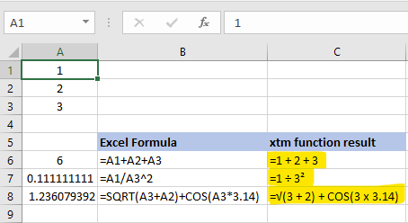

<strong>This Excel function (an Add-in) will show Excel formulas in the “math” format.</strong>

To use the Add-in:

<ol>
    <li>Open a new Excel file. </li>
    <li>Press ALT-F11 to open the VBA GUI. </li>
    <li>Right click on Microsoft Excel objects and insert a new Module. </li>
    <li>Copy the XL-Formula-to-Math.txt code in the right pane. </li>
    <li>Go back to the Excel file and save the document as an Excel Add-in (*.xlam) with the filename XL-Formula-to-Math.xlam to C:\Users\your Profile\AppData\Roaming\Microsoft\AddIns. </li>
    <li>Click File --> Options --> Add-ins then GO, with the drop-down showing Excel Add-ins. </li>
    <li>On the next screen, check the box next to XL-Formula-to-Math and click OK. </li>
    <li>Close the Excel file (saving is not necessary). Next time you open an Excel file, the xtm function will be available. </li>
</ol>

The goal of this project is to have an Add-in that will work with most common math operations in different combinations. 

XL-Formula-to-Math
